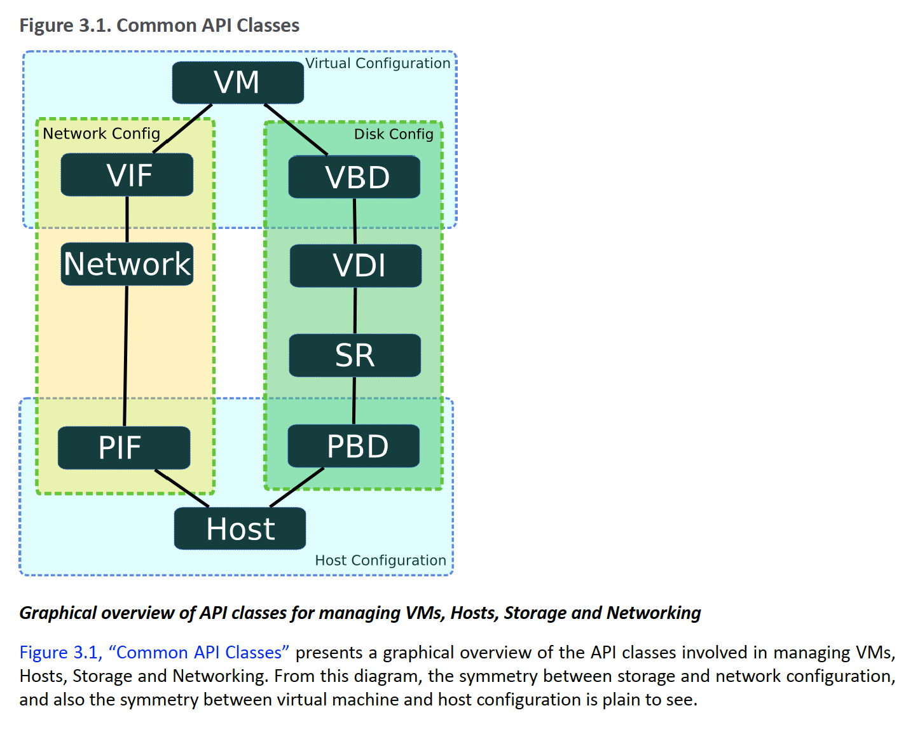

# ReadME


## Env Setting Up:

    1). create a virtual env with python2.7

        virtualenv -p python2 venv
    2). add the root directory of this project to PYTHONPATH

        eg: you clone this project in directory ~/mygit, please add ~/mygit/dev_virt to PYTHONPATH:

        export PYTHONPATH=$PYTHONPATH:~/mygit/dev_virt

    3). install pip requirements

        source venv/bin/activate && pip install -r requirements.txt

    4). set up the DB_HOST, eg: example.com or 127.0.0.1:8000 for localhost test

        export DB_HOST=127.0.0.1:8000

    5). setup the platform env: Xen for xenserver or KVM for KVM platform, the default is Xen

        export PLATFORM=KVM

    6). Log server is available to write the debug and exception infor to /var/log/virt.log. Remember to use sudo when
        start the log server in case of no permission to the directory /var/log

        sudo nohup python ~/dev_virt/lib/Log/logging_server.py &
## Xenserver API Architecture
 

## Some phrase:
- PIF: physical interface, the eth on server
- VIF: virtual  interface, the eth on VM
- SR:  storage repository, the storage pool on server

# Create KVM VMs Auto Schedule

  Note: `schedule_node.py` can auto schedule the wanted vm to a available server  
  you can list the supported role with `--list-roles`, if there is no role you want, you can define a new one  
  in `etc/Nodeconfig.json`, each role is a dict defined the cpu, memory, etc. You can define `k8s-master`,  
  `k8s-node`, `etcd` template as you want.  
  
  for example:
  
  ```
      "jenkins": {
        "cpu": 8,
        "memory": 32,
        "template": "template",
        "disk_size": 100,
        "add_disk_num": 2
    }
  ```

##  1. Auto schedual the target vm to a available server

  > schedule_node.py --role=rolename --cluster=<dev|test|prod>
  
  > Note: user can define the vm-name rule at function `generate_vmname_key(role, cluster)` in file `lib/Utils/schedule.py`

##  2. manually given the target vm-name, host and vm-ip.

  > schedule_node.py --role=rolename --name=new_vm_name --host=hostip --ip=vm_ip
  
# Create multiple VMs from xml config
- `setup_vms.py --validate xmlFile`     Validate the given xml file
- `setup_vms.py --create   xmlFile`     Do the create up according to the xml file

Create VMs with xml just need to write a xml config following the xml-example. Before really creating VMs, please run
*setup_vms.py --validate* to check your xml.

```xml
<servers xmlns:xsi="http://www.w3.org/2001/XMLSchema-instance" xsi:noNamespaceSchemaLocation="">
  <SERVER serverIp="192.168.1.17" user="root" passwd="xxxxxx">
        <!--VM element: vmname, template is required, others are options, if you want to keep those options params same with that in template, don't set it here -->
        <VM vmname="createViaXml" cpucores="2" cpumax="4" memory="2" maxMemory="4" template="NewTemplate">

            <!--IP element: vifIndex and ip is required, device/network/bridge is options, if no device/network/bridge, will choose manage network as default -->
            <IP vifIndex="0" ip="192.168.1.240" network="xenbr1" />

            <!--add multiple IPs here -->

            <!--DISK element: size is required, storage is options, if no storage, it will choose the storage which has largest free size -->
            <DISK size="2" storage="Local storage" />

            <!-- add multiple DISK here -->
        </VM>

        <!-- add multiple VMs here in the same server -->

  </SERVER>

  <!--here you can add another server -->
  <SERVER serverIp="192.168.1.15" user="root" passwd="xxxxxx">
      <!--VM element: vmname, template is required, others are options -->
        <VM vmname="createViaXml2" cpucores="1" cpumax="2" minMemory="1" memory="2" maxMemory="3" template="NewTemplate">
            <!--IP element: vifIndex and ip is required, device/network/bridge is options, if no device/network/bridge, will choose manage network as default -->
            <IP vifIndex="0" ip="192.168.1.241" device="eth1" />
            <IP vifIndex="1" ip="192.168.1.241" network="xenbr1" />
            <IP vifIndex="2" ip="192.168.1.242" bridge="xenbr1" />
            <!--DISK element: size is required, storage is options, is no storage, it will choose the storage which has largest free size -->
            <DISK size="2" />
        </VM>
  </SERVER>
</servers>
```


# Scripts:

## 1. Sync information from exist server to database

   - `sync_server_info.py`          will sync both server and VM information to DB, and create a record in DB if not exist
   - `sync_server_info.py --update` Just update information to DB

## 2. create_vm.py

  - `--list-vm`             List all the vms in server.
  - `--list-templ`          List all the templates in the server.
  - `--list-network`        List the bridge/switch network in the host
  - `--list-SR`             List the storage repository infor in the host

#####  2.1). <b>**Create a new VM with a template:**<b>
  - `-c VM_NAME, --create=VM_NAME`                        Create a new VM with a template.
  - `-t TEMPLATE, --templ=TEMPLATE`                       Template used to create a new VM.

    > create_vm.py -c "test_vm" -t "CentOS 7.2 Template"

#####  2.2). <b>**Create a new VM with a given IP: if a IP specified**<b>
  - `--vif=VIF_INDEX`      The index of virtual interface on which configure will be
  - `--device=DEVICE`      The target physic NIC name with an associated network VIF attach(ed) to
  - `--network=NETWORK`    The target bridge/switch network which VIF connect(ed) to
  - `--ip=VIF_IP`          The ip assigned to the virtual interface

    **a VIF index(*--vif*) is needed and a PIF name(*--device*) or a bridge name(*--network*) is needed**
    > create_vm.py -c "test2" -t "CentOS 7.2 template" --ip=192.168.1.100 --vif=0 --device=eth0

    > create_vm.py -c "test2" -t "CentOS 7.2 template" --ip=192.168.1.100 --vif=0 --network="xapi0"

    **neither *--device* nor *--network*, the default manage network will be used**
    > create_vm.py -c "test2" -t "CentOS 7.2 template" --ip=192.168.1.100 --vif=0

#####  2.3). <b>**Create a new VM with given max cpu cores and current cpu cores:**<b>
  - `--cpu-max=MAX_CORES`   Config the max VCPU cores.
  - `--cpu-cores=CPU_CORES` Config the number of startup VCPUs for the new created VM

    > create_vm.py -c "test2" -t "CentOS 7.2 template" --cpu-core=2 --cpu-max=4

    The max cpu cores can be configured when VM is power off only, and it affect the upper limit when set the cpu cores lively

#####  2.4). <b>**Create a new VM with memory size:**<b>
  - `--memory=MEMORY_SIZE`  Config the target memory size in GB.
  - `--min-mem=MIN_MEMORY`  Config the min static memory size in GB.
  - `--max-mem=MAX_MEMORY`  Config the max static memory size in GB.

     <b>There are static memory and dynamic memory. The static memory can be set only when VM is power off, and dynamic memory
  can be set when VM is running or stop. Memory limits must satisfy: *min_static_memory <= min_dynamic_memory <= max_dynamic_memory <= max_static_memory*. The max_static_memory will affect the upper limit when set the dynamic memory lively when VM is running.<b>


  - `--memory will set the min dynamic memory and max dynamic memory to the target one, when VM power on, it runs at that memory size`
  - `--min-mem will set the min static memory `
  - `--max-mem will set the max static memory `
    > create_vm.py -c "test2" -t "CentOS 7.2 template" --memory=2 --max-mem=4

##### 2.5).Add new disk to VM, the storage_name is choosed from *--list-SR*
  - `--add-disk=DISK_SIZE`  The disk size(GB) add to the VM
  - `--storage=STORAGE_NAME` The storage location where the virtual disk put
    > create_vm.py "test1"--add-disk=2 --storage=data2

    **if no *--storage*, will use the storage which has a largest free volume**
    > create_vm.py "test1"--add-disk=2

## 3. delete_vm.py
  To delete a vm, please use *delete_vm.py --vm=vm_to_delete*, this will ask user to input 'yes' or 'no' to confirm
  - `delete_vm.py  --vm=vm_name [--host=ip --user=user --pwd=passwd]`
  
  if `--force` is set, then the additional disk on vm will also be deleted, this feature is only support on kvm now.

## 4. config_vm.py
#### The IP and memory configuration is same as that in create VM.
  - `--list-vif`            List the virtual interface device in guest VM
  - `--list-pif`            List the interface device in the host
  - `--list-network`        List the bridge/switch network in the host
  - `--list-SR`             List the storage repository information in the host

##### 4.1). <b>**Config a VM's interface, add a VIF, delete a VIF, config a VIF(will delete old one if exist, otherwise create it newly), and the *--ip*, *--device*, *--network* is same as that when create vm**<b>
  - `--add-vif=ADD_INDEX`   Add a virtual interface device to guest VM
  - `--del-vif=DEL_INDEX`   Delete a virtual interface device from guest VM
  - `--vif=VIF_INDEX`      Configure on a virtual interface device

    > config_vm.py "test1"  --vif=0 --ip=192.168.1.200 --device=eth0

    > config_vm.py "test1"  --add-vif=1 --device=eth1 --ip=192.168.1.200 --netmask=255.255.255.0

##### 4.2). <b>**config a VM' cpu when it is running**<b>
  - `--cpu-cores=CPU_CORES` Config the VCPU cores lively for a running VM or the number of startup VCPUs for a halted VM

      > config_vm.py "test1" --cpu-core=4

##### 4.3). <b>**config a VM' memory when it is running**<b>
  - `--memory=MEMORY_SIZE`  Config the target memory size in GB.

    > config_vm.py "test1" --memory=1

##### 4.4).Add new disk to VM, the storage_name is choosed from *--list-SR*
  - `--add-disk=DISK_SIZE`  The disk size(GB) add to the VM
  - `--storage=STORAGE_NAME` The storage location where the virtual disk put
    > config_vm.py "test1"--add-disk=2 --storage=data2

    **if no *--storage*, will use the storage which has a largest free volume**
    > config_vm.py "test1"--add-disk=2


## 5. power_on.py, power_off.py
 - power_on.py vm1 vm2 \[--host=ip --user=user --pwd=passwd\]
 - power_off.py vm1 vm2 \[--host=ip --user=user --pwd=passwd\]

## 6. dump_vm.py, ist the memory, CPU, Disk, and system information of VM
  - `--list`                List the cpu and memory information
  - `--list-disk`           List the virtual disk size
  - `--list-vifs`           List all the VIFs information

    **if no options, will list all basic informations, include, cpu, memory, os, disk, interface mac and IP**

    **Note: a problem is that the VIF index given to xenserver, but it is not always the index of eth in VM guest, it depend on the create sequence of virtual interface.**

## 7. dump_host.py, list the memory, CPU, Disk, and system information of server
  - `--list-sr`             List all the storage information
  - `--list-pif`            List all the interface information
  - `--list-bond`           List all the bond information
  - `--list-vm`             List all the vms
  - `--list-templ`          List all the templates in the server.
  - `--list-network`        List the network in the host (in Xenserver, it is same as bridge)
  - `--list-bridge`         List the bridge/switch names in the host

    > dump_host.py    \[--host=ip --user=user --pwd=passwd\]

    > dump_host.py --list-sr \[--host=ip --user=user --pwd=passwd\]
